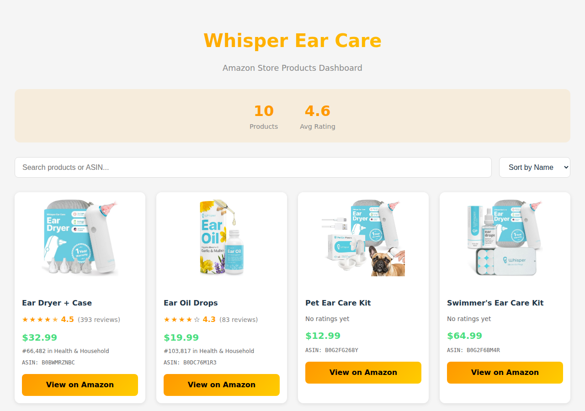

# Amazon Store Product Scraper & Dashboard

A Python scraper that extracts product data from Amazon store pages, paired with a React dashboard for visualizing and exploring the collected data.



## Features

### Scraper
- Automated browser-based scraping using Playwright
- Extracts comprehensive product data:
  - Product name and ASIN
  - Price and main product image
  - Star rating and review count
  - Best Sellers Rank
- Handles Amazon's dynamic content loading
- Exports data to CSV format

### Dashboard
- Interactive product grid with images
- Search by product name or ASIN
- Sort by name, price, or rating
- Displays aggregate stats (total products, average rating)
- Direct links to Amazon product pages

## Tech Stack

| Component | Technologies |
|-----------|-------------|
| Scraper | Python, Playwright, Pandas |
| Dashboard | React 18, TypeScript, Vite, Tailwind CSS |

## Installation

### Scraper Setup
```bash
# Create and activate virtual environment
python -m venv .venv
source .venv/bin/activate  # Linux/Mac
# or: .venv\Scripts\activate  # Windows

# Install dependencies
pip install playwright pandas
playwright install chromium
```

### Dashboard Setup
```bash
cd dashboard
npm install
```

## Usage

### Run the Scraper
```bash
source .venv/bin/activate
python scraper.py
```
This outputs `amazon_whisper_store_products.csv` with all scraped product data.

### Run the Dashboard
```bash
cd dashboard
npm run dev
```
Opens at `http://localhost:5173`

### Build for Production
```bash
cd dashboard
npm run build
```

## Updating Dashboard Data

1. Run the scraper to generate fresh CSV data
2. Convert CSV to JSON format
3. Replace `dashboard/src/data/products.json`
4. Rebuild the dashboard

## Project Structure

```
├── scraper.py           # Main scraper script
├── debug.py             # Dashboard testing utility
├── dashboard/
│   ├── src/
│   │   ├── App.tsx      # Main React component
│   │   ├── types/       # TypeScript interfaces
│   │   └── data/        # Static product data (JSON)
│   └── package.json
└── CLAUDE.md            # AI assistant context
```

## Live Demo

[View Dashboard](https://kimm-coder.github.io/amazon-whisper-scraper/)
